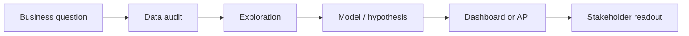
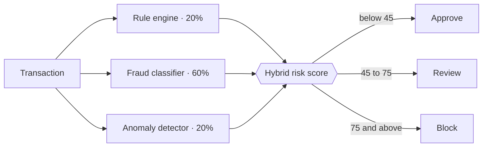
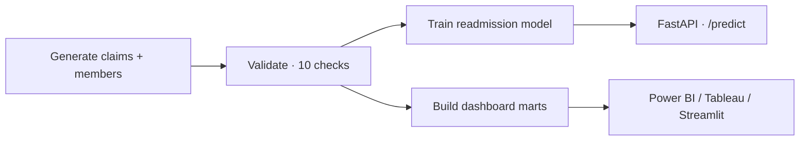

<div align="center">


<a href="https://rahul9121.github.io/portfolio/">
  
</a>

<br/>

<a href="https://rahul9121.github.io/portfolio/"></a>
<a href="https://www.linkedin.com/in/rahul-ega03-/"></a>
<a href="mailto:rahulega695@gmail.com"></a>
<a href="https://rahul9121.github.io/portfolio/assets/rahulEgaCV.pdf"></a>


<br/><br/>

<a href="#about">About</a> &nbsp;·&nbsp;
<a href="#impact">Impact</a> &nbsp;·&nbsp;
<a href="#toolkit">Toolkit</a> &nbsp;·&nbsp;
<a href="#projects">Projects</a> &nbsp;·&nbsp;
<a href="#experience">Experience</a> &nbsp;·&nbsp;
<a href="#contact">Contact</a>

</div>

<br/>

> **30-second tour:** start with **[Fraud Detection](https://github.com/Rahul9121/fintech-fraud-detection-monitoring-system)** → **[Healthcare Claims Intelligence](https://github.com/Rahul9121/healthcare-claims-intelligence-dashboard)** → **[Loan Default Prediction](https://github.com/Rahul9121/banking-risk-loan-default-prediction)**. Those three show the full loop: data → model → API → dashboard → CI/CD.

<br/>

## About

Senior Data Analyst with 5+ years across **healthcare, banking, and fintech**. I build scalable SQL pipelines, predictive models, and executive dashboards, and I ship them as working products rather than slide decks. Every deliverable answers three questions: *what happened, why it happened, and what to do next.*

```python
rahul = {
    "role":       "Senior Data Analyst · BI Developer",
    "based_in":   "New York, USA",
    "domains":    ["Healthcare", "Banking", "Fintech"],
    "core_stack": ["SQL", "Python", "Power BI", "Tableau", "Snowflake"],
    "education":  "M.S. Data Analytics — Montclair State University (2025)",
    "philosophy": "Every dataset is a narrative waiting to be told.",
    "exploring":  ["SHAP explainability", "drift monitoring", "dbt lineage"],
    "open_to":    ["Data Analyst", "Sr. Data Analyst", "BI Developer", "Analytics Engineer"],
}
```

**How I approach a problem**



<br/>

## Impact

<div align="center">
<table>
  <tr>
    <td align="center" width="25%"><h2>120M+</h2><sub>member records<br/>queried &amp; modeled</sub></td>
    <td align="center" width="25%"><h2>−55%</h2><sub>reporting effort<br/>via automation</sub></td>
    <td align="center" width="25%"><h2>+45%</h2><sub>SQL query<br/>performance</sub></td>
    <td align="center" width="25%"><h2>0.87</h2><sub>AUC on readmission-<br/>risk model (pilot)</sub></td>
  </tr>
</table>

<table>
  <tr>
    <td align="center" width="33%"><b>Healthcare</b><br/><sub>Utilization analytics · readmission risk · care-gap intelligence</sub></td>
    <td align="center" width="33%"><b>Banking</b><br/><sub>Portfolio performance · credit risk · executive KPI scorecards</sub></td>
    <td align="center" width="33%"><b>Fintech</b><br/><sub>Fraud detection · payment analytics · operational reporting</sub></td>
  </tr>
</table>
</div>

<br/>

## Toolkit

<table>
  <tr>
    <td width="180"><b>Languages &amp; Analysis</b></td>
    <td>
      
      
      
      
      
      
      
    </td>
  </tr>
  <tr>
    <td><b>Machine Learning</b></td>
    <td>
      
      
      
      
      
      
    </td>
  </tr>
  <tr>
    <td><b>BI &amp; Visualization</b></td>
    <td>
      
      
      
      
      
      
      
    </td>
  </tr>
  <tr>
    <td><b>Databases</b></td>
    <td>
      
      
      
      
      
      
    </td>
  </tr>
  <tr>
    <td><b>Apps, APIs &amp; DevOps</b></td>
    <td>
      
      
      
      
      
      
      
    </td>
  </tr>
  <tr>
    <td><b>Methods</b></td>
    <td>
      
      
      
      
      
      
      
    </td>
  </tr>
</table>

<br/>

## Projects

Ordered **from most to least complex**. Complexity reflects scope (modeling, deployment, testing, architecture), not how much I enjoyed a project.

### 🏆 Tier 1 — Production-Grade Systems
`Complexity ▰▰▰▰▰` &nbsp;·&nbsp; ML + API + dashboard + containerization + CI

#### Fintech Fraud Detection & Monitoring

`Python` `scikit-learn` `SQLite` `Streamlit` `Docker` `GitHub Actions`

A transaction-monitoring engine that blends deterministic rules with supervised ML and unsupervised anomaly detection, trained on the public European card-fraud benchmark dataset.

- **Hybrid scoring:** 60% ML fraud probability, 20% anomaly risk, 20% rule score, mapped to approve / review / block bands
- **SQL-backed monitoring:** fraud trends, success rates, channel-level risk, and a high-risk alert table
- **Analyst tooling:** Streamlit dashboard with a live transaction-scoring form
- **Engineering:** Dockerized, unit-tested, CI on every push

[▶ Live demo](https://fintech-fraud-detection-monitoring-system-rahulega.streamlit.app/) &nbsp;·&nbsp; [</> Source](https://github.com/Rahul9121/fintech-fraud-detection-monitoring-system)

<details>
<summary><b>View scoring architecture</b></summary>



</details>

<br/>

#### Healthcare Claims Intelligence + Readmission Risk API

`Python` `FastAPI` `scikit-learn` `PostgreSQL` `Streamlit` `Docker` `GitHub Actions` `Render`

A payer-analytics workflow that mirrors real care-management work: engineer the data, validate it, model readmission risk, publish dashboard-ready marts, and serve predictions from a deployed API.

- **Data quality:** automated validation suite (keys, foreign keys, date logic, financial logic), 10/10 checks passing
- **Analytics marts:** utilization trends, cost drivers, provider performance, and cohort analysis for BI tools
- **Model:** readmission classifier with ROC-AUC 0.74 on 18K synthetic claims
- **Serving:** `/predict` and `/predict/batch` endpoints with Swagger docs; CI runs the pipeline, Ruff, and Pytest

[▶ Live dashboard](https://healthcare-claims-dashboard-rahul.onrender.com/) &nbsp;·&nbsp; [API docs](https://healthcare-claims-risk-api-rahul.onrender.com/docs) &nbsp;·&nbsp; [</> Source](https://github.com/Rahul9121/healthcare-claims-intelligence-dashboard)

<details>
<summary><b>View pipeline architecture</b></summary>



</details>

<br/>

#### Banking · Loan Default Prediction

`Python` `XGBoost` `scikit-learn` `FastAPI` `Streamlit`

An end-to-end credit-risk system: feature-engineered loan applications, a gradient-boosted classifier with calibrated probabilities, a FastAPI scoring service, and a Streamlit dashboard built for risk officers.

[▶ Live demo](https://banking-risk-loan-default-prediction-qs7wrvawdzqqqng57crjmp.streamlit.app/) &nbsp;·&nbsp; [</> Source](https://github.com/Rahul9121/banking-risk-loan-default-prediction)

<br/>

### 📈 Tier 2 — Statistical & Geospatial Analytics
`Complexity ▰▰▰▰▱` &nbsp;·&nbsp; Modeling rigor, experimentation, and spatial reasoning

| Project | What it does | Stack | Links |
|:--|:--|:--|:--|
| **Time-Series Forecasting Studio** | Benchmarks ARIMA / SARIMA against ML regressors on sales and demand series, with seasonality decomposition, residual diagnostics, MAPE / RMSE comparison, and CSV-exportable forecasts | `Statsmodels` `Prophet` `Scikit-learn` `Streamlit` | [Live](https://time-series-forecasting-business-metrics-by-rahulega.streamlit.app) · [Code](https://github.com/Rahul9121/time-series-forecasting-business-metrics) |
| **A/B Testing Analytics Dashboard** | Experimentation workbench that accepts uploaded, simulated, or Kaggle data, runs frequentist tests, computes power and lift, and turns p-values into plain-English decisions | `SciPy` `Statsmodels` `Plotly` `Streamlit` | [Live](https://ab-testing-analytics-dashboard-by-rahulega.streamlit.app/) · [Code](https://github.com/Rahul9121/ab-testing-analytics-dashboard) |
| **Bioscope · Biodiversity Risk** | Geospatial compliance assistant for New Jersey businesses: scores ecological risk by location from a species and habitat database, recommends mitigations, and renders interactive maps | `Flask` `PostgreSQL` `Leaflet.js` `REST API` `Vercel` | [Live](https://bioscope-project.vercel.app/) · [Code](https://github.com/Rahul9121/bioscope-project) |

<br/>

### 🧩 Tier 3 — Full-Stack Data Applications
`Complexity ▰▰▰▱▱` &nbsp;·&nbsp; Relational design, authentication, role-based access

| Project | What it does | Stack | Links |
|:--|:--|:--|:--|
| **Tax Tracker System** | Lets finance teams log company tax records, monitor pending payments, and audit activity, with role-based access modeled on real CFO workflows | `Flask` `MySQL` `SQLAlchemy` `RBAC` `Render` | [Live](https://tax-tracker-system.onrender.com/) · [Code](https://github.com/Rahul9121/tax-tracker-system) |
| **Student Management System** | Academic operations platform covering registration, courses, grade entry, and performance analytics on a relational schema with secure auth | `Flask` `SQLAlchemy` `MySQL` `Bootstrap` | [Live](https://student-management-system-rahul-1.onrender.com/) · [Code](https://github.com/Rahul9121/Student-Management-System-Rahul) |

<br/>

### 🔍 Tier 4 — Exploratory Analysis & Data Storytelling
`Complexity ▰▰▱▱▱` &nbsp;·&nbsp; Where the habit of asking good questions started

| Project | What it does | Stack | Links |
|:--|:--|:--|:--|
| **Airbnb NYC · EDA Studio** | Explores 39K+ listings end to end: pricing distributions, neighborhood and room-type demand, geographic heatmaps, and host concentration | `Pandas` `Plotly` `Seaborn` `Streamlit` | [Live](https://airbnb-rahul-app-ep3hwhtjgmony9o99rgkqs.streamlit.app/) · [Code](https://github.com/Rahul9121/airbnb-rahul-streamlit) |
| **IPL Data Visualization (2008–2017)** | A decade of Indian Premier League data: toss impact on win rate, venue advantage, run-rate dynamics, and top performers, told through narrative visuals | `Jupyter` `Pandas` `Matplotlib` `Seaborn` | [Live](https://ipldataviz-rahul-32skz7xsewg6e4tmeouwum.streamlit.app/) · [Code](https://github.com/Rahul9121/iplDataViz-rahul) |

<br/>

## Experience

| Period | Role | Selected impact |
|:--|:--|:--|
| **Aug 2024 – Present** | **Senior Data Analyst**<br/>Optum Health · New York | SQL across Snowflake, Oracle, and SQL Server on 120M+ member records<br/>Cohort and utilization analyses that lifted member retention by 18%<br/>Readmission-risk models (AUC 0.87) that cut 30-day readmissions by 12% in pilot cohorts |
| **May 2021 – Aug 2023** | **Data Analyst**<br/>Fiserv · Hyderabad | Analyzed 2M+ daily transactions and lifted processing success rate by 3.4 points<br/>Cut insight latency from 24 hours to under 2 hours with Oracle and PostgreSQL ETL<br/>Fraud, merchant, and SLA dashboards used daily by 15+ stakeholders |
| **Jan 2020 – May 2021** | **Data Analyst**<br/>Wells Fargo · Hyderabad | Analyzed a $3B+ loan portfolio for origination, delinquency, and risk reviews<br/>Flagged $480K+ in suspect activity with SQL and Python anomaly screening<br/>Automated month-end reporting, closing the cycle 3 business days faster |

**Education:** M.S. in Data Analytics, Montclair State University (May 2025)

<br/>

## GitHub Activity

<div align="center">

<picture>
  <source media="(prefers-color-scheme: dark)" srcset="https://raw.githubusercontent.com/Rahul9121/Rahul9121/output/github-snake-dark.svg" />
  <source media="(prefers-color-scheme: light)" srcset="https://raw.githubusercontent.com/Rahul9121/Rahul9121/output/github-snake.svg" />
  
</picture>

<br/><br/>





</div>

<br/>

## Contact

<div align="center">

<table>
  <tr>
    <td align="center" width="50%"><b>Roles I'm looking for</b><br/><sub>Data Analyst · Senior Data Analyst · BI Developer<br/>Analytics Engineer · Product / Decision Science</sub></td>
    <td align="center" width="50%"><b>How I like to work</b><br/><sub>Full-time or contract · Hybrid or remote<br/>US-based, currently authorized to work in the US</sub></td>
  </tr>
</table>

<br/>

<a href="mailto:rahulega695@gmail.com"></a>
<a href="https://www.linkedin.com/in/rahul-ega03-/"></a>
<a href="https://rahul9121.github.io/portfolio/"></a>

<br/><br/>

<sub><i>"Every dataset is a narrative waiting to be told."</i></sub>

<br/>


</div>
